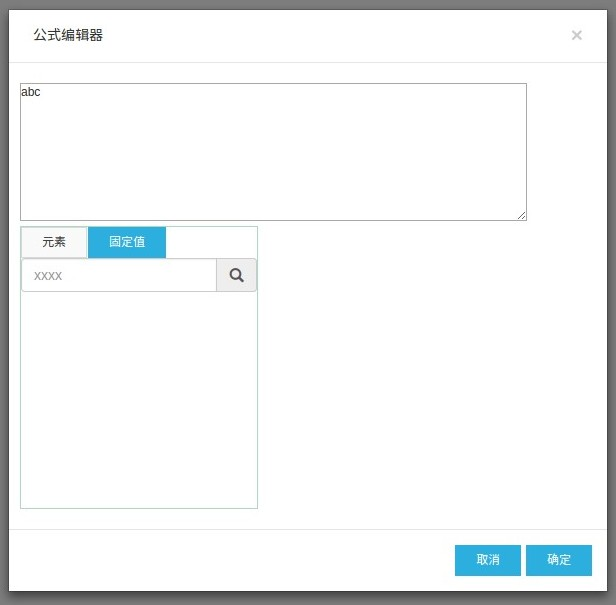

# ssc-formula



## 本地开发调试

```
npm run dev
```

浏览器会自动打开demo

因为该组件需要从后端获取数据（比如参照数据），所以推荐使用[ssc-dev-server](https://github.com/yyssc/ssc-dev-server)
以便协助开发。

## 如何发布

1. 编译`npm run build`
2. 修改`package.json`中的版本号
3. 提交`git add . && git commit -m 'Release v0.1.0'`
4. 打tag： `git tag -a v0.1.0 -m 'v0.1.0'`
5. push到remote： `git push --follow-tags`
6. 发布： `npm publish`

## TODO

- [x] Demo
- [ ] 单元测试
- [ ] 发布脚本
